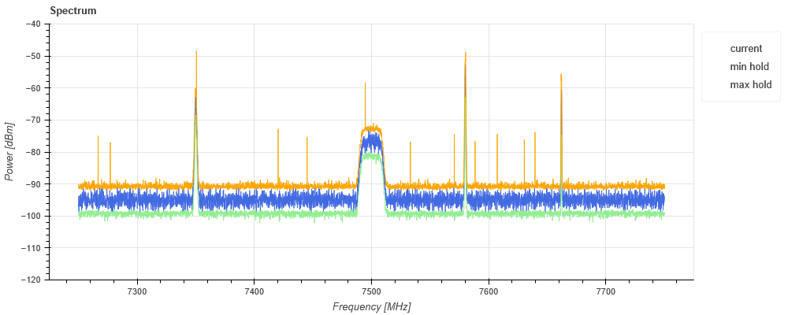

## 概要

スペクトラムアナライザ風な画面を Python で実現できるかのお試し実装です。
無線通信のスペクトラムを擬似的に生成して表示します。Bokehライブラリを利用しています。

## 動作条件

開発時のバージョンは次です。

| 言語・ライブラリ名 | バージョン | 備考 |
|---|---|---|
| Python | 3.14 | 3.12でも動作 |
| Bokeh  | 3.9.0 | 3.6.0でも動作 |
| NumPy  | 2.4.5 | 1.26.4でも動作 |

最新の仕様は使っていないので、Python 3.12、Bokeh 3.x で動作すると思われます。

## リポジトリのクローンと環境設定
GitHubのリポジトリをcloneし、venvを使って実行環境を構築します。
git および Python 3.12以降がインストールされた環境で以降を実施します。

### クローン
GitHubからリポジトリをcloneします。
Windows/PowerShellコンソールでの実行例を示します。

```shell
PS D:\work> git clone https://github.com/torutk/SpectrumAnalyzer_Ui_demo.git
  :
PS D:\work> cd SpectrumAnalyzer_Ui_demo
PS D:\work\SpectrumAnalyzer_Ui_demo> 
```
### 実行環境の構築
使用するPythonバージョンを指定し仮想環境（venv）を生成、アクティベートしてから依存ライブラリをインストールします。
bokehをインストールすると依存関係によりnumpyもインストールされます。
```shell
PS D:\work\SpectrumAnalyzer_Ui_demo> py -3.14 -m venv .venv
PS D:\work\SpectrumAnalyzer_Ui_demo> .\.venv\Scripts\Activate.ps1
(.venv) PS D:\work\SpectrumAnalyzer_Ui_demo> pip install bokeh
  :
  Successfully installed MarkupSafe-3.0.3 bokeh-3.10.0 jinja2-3.1.6 narwhals-2.25.0 numpy-2.5.2 packaging-26.3
   pillow-12.3.0 pyyaml-6.0.3 tornado-6.5.8 xyzservices-2026.9.1
(.venv) PS D:\work\SpectrumAnalyzer_Ui_demo> 
```

## 実行方法

```shell
PS D:\work\SpectrumAnalyzer_Ui_demo> bokeh serve spectrum_ui --show
```


## ソースファイル構成

* spectrum_ui.py  
Bokehライブラリを利用して無線通信スペクトラムをプロットする
* spectrum.py  
乱数で無線通信スペクトラムデータを疑似的に生成する
* spectrum_generator.py  
（試行）別なやり方で無線通信スペクトラムデータを疑似的に生成しBokehライブラリを利用してグラフにプロットする。
上述2つのファイルとは独立したコード。

## ドキュメント

詳細なドキュメントは [Wiki](../../wiki) を参照ください。
